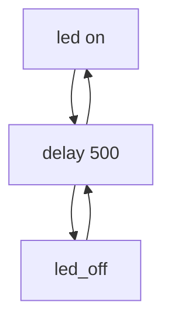

# PRACTICA 1
```
#include <Arduino.h>

#define LED 2

void setup() {
  // put your setup code here, to run once:

  Serial.begin(115200);

  pinMode(LED,OUTPUT);
}

void loop() {
  // put your main code here, to run repeatedly:

  delay(500);
  Serial.println("on");
  digitalWrite(LED,HIGH);

  delay(500);
  Serial.println("off");
  digitalWrite(LED,LOW);
}
```
```
DIAGRAMA DE FLUJO 
```


```
DIAGRAMA DE TIEMPOS
```

```wavedrom
{ "signal": [
    {},
    { name: "Data",wave: "343434343", 
    data: ["on", "off", "on", "off","on", "off", "on", "off", "on"]},
    { "name": "LED","wave": "101010101" },
    {}
  ]}
```
El tiempo libre del procesador es de 500 ms 
(1s = 1000ms)
